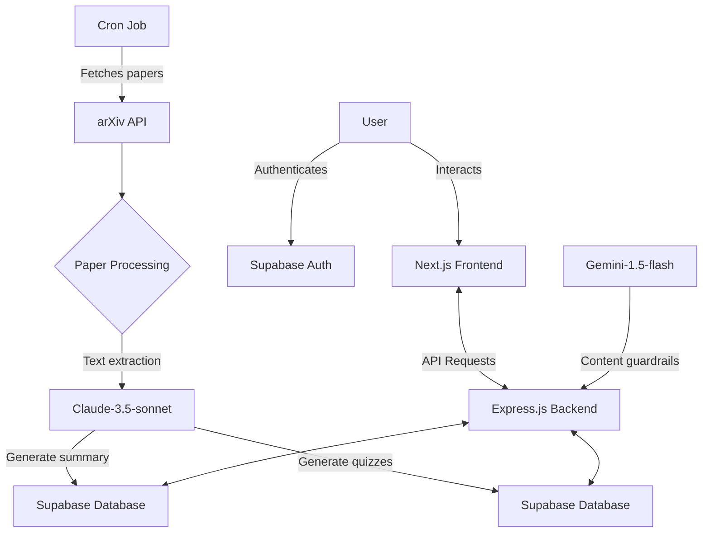

## Table of Contents

1. [Executive Summary](#1-executive-summary)

2. [Introduction](#2-introduction)

   2.1 [Project Overview](#21-project-overview)

   2.2 [Inspiration and Origin of the Idea](#22-inspiration-and-origin-of-the-idea)

3. [Project Purpose and Objectives](#3-project-purpose-and-objectives)

4. [Technical Architecture](#4-technical-architecture)

   4.1 [Technology Stack](#41-technology-stack)

   4.2 [System Architecture](#42-system-architecture)

5. [Features and Functionality](#5-features-and-functionality)

   5.1 [Core Features](#51-core-features)

   5.2 [User Interface](#52-user-interface)

   5.3 [Backend Processes](#53-backend-processes)

6. [Development Process](#6-development-process)

   6.1 [Methodology](#61-methodology)

   6.2 [Challenges and Solutions](#62-challenges-and-solutions)

7. [Future Enhancements](#7-future-enhancements)

8. [Conclusion](#8-conclusion)

  

## 1. Executive Summary

  
**NeuraLeverage**, also known as **Gakunn**, is an innovative platform designed to transform AI research papers into interactive quizzes. The project addresses the growing challenges of information overload and cognitive load in the rapidly advancing field of artificial intelligence. By converting complex research content into gamified learning experiences, NeuraLeverage enhances knowledge retention and makes cutting-edge AI research more accessible to learners.

  

The platform utilizes a modern tech stack, including:

- **Next.js** for the frontend

- **Express.js** for the backend

- **Supabase** for authentication and database management

  

It employs advanced AI models such as **Gemini-1.5-flash** and **Claude-3.5-sonnet** for content generation and quality control. With its automated paper collection and quiz generation system, NeuraLeverage has successfully transformed over 1,000 research papers into more than 5,000 interactive quizzes.

  

## 2. Introduction

  

### 2.1 Project Overview

  

NeuraLeverage is a web-based platform that has successfully transformed over 1,000 research papers into more than 5,000 interactive quizzes. The platform leverages the principles of active learning to create engaging educational content, significantly improving retention rates compared to traditional passive learning methods.

  

### 2.2 Inspiration and Origin of the Idea

  

The conception of NeuraLeverage was driven by two critical observations in the field of artificial intelligence:

  

1. The **exponential growth** in AI research publications

2. The **increasing difficulty** for learners to effectively assimilate and retain information from this vast body of knowledge

  

These observations highlighted the need for innovative approaches to knowledge dissemination and learning in the AI domain. The project's creator, *Hitesh Bandhu*, envisioned a solution that could bridge the gap between complex research output and learner comprehension through interactive, gamified experiences.

  

## 3. Project Purpose and Objectives

  

The primary purpose of NeuraLeverage is to transform the way individuals engage with and learn from AI research. The key objectives of the project include:

  

1. To convert complex AI research papers into accessible, interactive quiz formats

2. To enhance retention rates of technical information through active learning principles

3. To address the challenges of cognitive load and information overload in AI education

4. To create a platform that makes cutting-edge AI research more approachable for a wider audience

5. To promote efficient knowledge dissemination in the rapidly evolving field of AI

6. To implement a system for automated collection and processing of new research papers

7. To develop a scalable architecture capable of handling a growing database of papers and quizzes

  

By achieving these objectives, NeuraLeverage aims to democratize access to advanced AI knowledge and accelerate learning in this critical domain.

  

## 4. Technical Architecture

  

### 4.1 Technology Stack

  

NeuraLeverage employs a modern, robust technology stack designed for scalability, performance, and maintainability:

  

| Component | Technology | Purpose |

|-----------|------------|---------|

| Frontend | Next.js | Server-side rendered and statically generated web application |

| Backend | Express.js | Minimal and flexible Node.js web application framework |

| Database & Auth | Supabase | Authentication services and PostgreSQL database |

| Vector Database | pgvector | AI plugin for Supabase, enabling efficient vector operations |

| AI Models | Gemini-1.5-flash | Implementing guardrails and ensuring content quality |

| | Claude-3.5-sonnet | Primary LLM for generating quizzes and summaries |

| Task Scheduling | Cron jobs | Regular paper collection and processing |

  

### 4.2 System Architecture

  

The NeuraLeverage system architecture is designed to efficiently process research papers, generate quizzes, and serve content to users. Here's a high-level overview of the system:

  

  

#### Server-side Processing:

1. **Paper Collection**: A cron job runs twice daily (12 AM and 12 PM) to fetch new, trending papers in the generative AI field from arXiv.

2. **Data Processing**:

   - The collected papers are added to the database.

   - Text is extracted and parsed from each paper.

   - Claude-3.5-sonnet generates a summary for each paper, which is stored in the database.

3. **Quiz Generation**: Parallel requests are sent to Claude-3.5-sonnet to generate quizzes based on the paper content. These quizzes are then saved to the quiz database.

4. **Authentication**: Standard authentication routes are implemented using Supabase.

  

#### Frontend Interaction:

1. **User Authentication**: Users log in and receive 10 free credits to try the project.

2. **Content Navigation**: Users select a field of interest (e.g., Computer Vision, Language Models, Transformers).

3. **Paper Selection**: Users browse through available papers and read the AI-generated summaries.

4. **Quiz Interaction**: Users can initiate quizzes for selected papers. Their scores are saved to the database.

  

## 5. Features and Functionality

  

### 5.1 Core Features

1. **Automated Paper Collection**: Regular fetching of new, relevant research papers from arXiv.

2. **AI-powered Summary Generation**: Utilization of Claude-3.5-sonnet to create concise summaries of complex research papers.

3. **Interactive Quiz Generation**: Automatic creation of quizzes based on paper content using advanced NLP techniques.

4. **User Authentication**: Secure login and user management system implemented with Supabase.

5. **Credit System**: Users receive 10 free credits upon registration to explore the platform's features.

6. **Field-specific Content Organization**: Papers and quizzes categorized by AI subfields for easy navigation.

  

### 5.2 User Interface

1. **Intuitive Dashboard**: Allows users to browse papers by category and access their quiz history.

2. **Paper Summary View**: Displays AI-generated summaries to give users a quick overview of each paper.

3. **Interactive Quiz Interface**: Engages users with multiple-choice questions derived from paper content.

4. **Progress Tracking**: Shows users their quiz scores and learning progress over time.

  

### 5.3 Backend Processes

1. **Automated Paper Processing Pipeline**: Handles the extraction, summarization, and quiz generation for new papers.

2. **Vector Database Integration**: Utilizes pgvector for efficient similarity searches and content recommendations.

3. **Content Quality Control**: Implements Gemini-1.5-flash as a guardrail to ensure the quality and relevance of generated content.

  

## 6. Development Process

  

### 6.1 Methodology

The development of NeuraLeverage followed an **Agile methodology**, emphasizing iterative development, continuous integration, and regular stakeholder feedback. The process included:

  

1. Initial Planning and Requirements Gathering

2. Architecture Design and Technology Stack Selection

3. Iterative Development Cycles

   - Frontend Development (Next.js)

   - Backend API Development (Express.js)

   - Database Schema Design and Implementation (Supabase)

   - AI Model Integration (Claude-3.5-sonnet, Gemini-1.5-flash)

4. Continuous Testing and Quality Assurance

5. Regular Code Reviews and Refactoring

6. Deployment and Performance Optimization

  

### 6.2 Challenges and Solutions

  

| Challenge | Solution |

|-----------|----------|

| **Large-scale Data Processing** | Implemented a scalable database architecture using Supabase and pgvector, optimizing for both storage and retrieval performance. |

| **Quiz Generation Quality** | Utilized Claude-3.5-sonnet for initial quiz generation and implemented Gemini-1.5-flash as a quality control measure to refine and validate quiz content. |

| **User Engagement** | Implemented a gamified approach with a credit system and plans for future leaderboards to foster healthy competition among users. |

| **System Scalability** | Adopted a microservices architecture and implemented efficient caching strategies to ensure system responsiveness under increasing load. |

  

## 7. Future Enhancements

  

1. **Leaderboards**: Implement a competitive element allowing users to compare their performance on research paper quizzes.

2. **Personalized Learning Paths**: Develop AI-driven recommendations for papers and quizzes based on user performance and interests.

3. **Collaborative Features**: Introduce functionality for users to create and share their own quizzes based on papers.

4. **Mobile Application**: Develop a native mobile app to increase accessibility and user engagement.

5. **Extended AI Field Coverage**: Expand the range of AI subfields covered by the platform, potentially including robotics, natural language processing, and more.

6. **Integration with Academic Institutions**: Explore partnerships with universities to incorporate NeuraLeverage into their AI curricula.

  

## 8. Conclusion

  

NeuraLeverage represents a significant advancement in the field of AI education and research dissemination. By leveraging cutting-edge technologies and innovative learning principles, the platform addresses the critical challenge of information overload in the rapidly evolving AI landscape. As the project continues to develop and expand its features, it has the potential to become an indispensable tool for students, researchers, and professionals seeking to stay at the forefront of AI knowledge and understanding.

  

The combination of automated paper processing, AI-powered content generation, and interactive learning experiences positions NeuraLeverage as a unique and valuable resource in the AI education ecosystem. As we move forward, our focus will be on refining the user experience, expanding our content coverage, and fostering a community of engaged learners in the AI field.